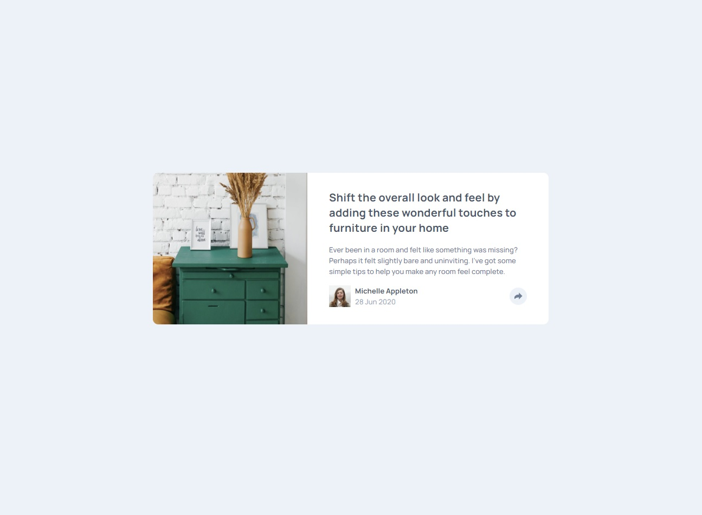

# Frontend Mentor - Article preview component solution

This is a solution to the [Article preview component challenge on Frontend Mentor](https://www.frontendmentor.io/challenges/article-preview-component-dYBN_pYFT). Frontend Mentor challenges help you improve your coding skills by building realistic projects.

## Table of contents

- [Overview](#overview)
  - [The challenge](#the-challenge)
  - [Screenshot](#screenshot)
  - [Links](#links)
- [My process](#my-process)
  - [Built with](#built-with)
  - [What I learned](#what-i-learned)
  - [Continued development](#continued-development)
  - [Useful resources](#useful-resources)
- [Author](#author)

## Overview

### The challenge

Users should be able to:

- View the optimal layout for the component depending on their device's screen size
- See the social media share links when they click the share icon

### Screenshot



### Links

- Solution URL: [Git Hub](https://github.com/MadsenBK/frontendMentor-0004_articlePreviewComponent)
- Live Site URL: [Netlify](https://strong-fenglisu-c34dbc.netlify.app/)

## My process

### Built with

- Semantic HTML5 markup
- CSS custom properties
- Flexbox

### What I learned

Doing this project I found how to use SVG files in a way that allows you to change the color of the SVG element such as how the back ground and arrow icon swap colors on hover for this project. I discovered the ability to open the SVG file in IDE and get the XML code which can then be placed directly into the HTML document and changing the fill property to 'currentColor' allowing the SVG image to use the color attribute in CSS for the element.

```html
<svg
	id="shareSVG"
	class=""
	xmlns="http://www.w3.org/2000/svg"
	width="15"
	height="13"
>
	<path
		fill="currentColor"
		d="M15 6.495L8.766.014V3.88H7.441C3.33 3.88 0 7.039 0 10.936v2.049l.589-.612C2.59 10.294 5.422 9.11 8.39 9.11h.375v3.867L15 6.495z"
	/>
</svg>
```

```css
#shareSVG {
	color: #6e8098;
}
```

### Continued development

I really enjoyed using the figma file on this one as it allowed for more precise layout of sizes, font-weight, font-size, etc. However I did find some of the measurements confusing between figma and live usage such as the positioning of the pop up display, so I would like to look into this more and figure out more precisely how this works.

### Useful resources

- [CSS Tricks](https://css-tricks.com/snippets/css/css-triangle/) - This helped me in creating the triangle element for the bottom of the pop up.
- [HUB Spot](https://blog.hubspot.com/marketing/social-sharing-links-quick-tip-ht) - This helped me in creating the links for sharing/creating posts on social media sites.

## Author

- Website - [BK Madsen](https://www.bkmadsen.com)
- Frontend Mentor - [@MadsenBK](https://www.frontendmentor.io/profile/MadsenBK)
